# README

Change Vmax in spectral code to 50 for $\sigma=1$ and 150 or 200 for $\sigma=5$.

## Summary of Files
1. `Global_Sens_Plots_from_Data_Instability.m` Plots the 1D sufficient summary plots with some variation from a given base parameter set. 
2. `Global_Sensitivity_PIC_VP_Kappa_dispersion_rate_p4.m` Code to run active subspaces with 4 parameters: $k,\theta,\mu,\kappa$.
3. `Kappa_Disp_Using_Xie.m` Solves the dispersion relation for the kappa bump-on-tail using Fourier series approximation for the complex integral as in the Xie/Weideman algorithm.
5. `Vlasov_1D_linearized_Steve_v4_Kappa.m` Fourth edition of the spectral method for solving VP with kappa equilibrium distribution.
6. `dielectric_kappa.m` Provides the functional forms for the kappa dielectric functions for $\kappa=1,2,6$.
7. `slurm_GS_PIC_BiKap_p4.slurm` Use to run script on Mio.
8. `zetaph.m` Code to produce Fourier series approximation as in Xie/Weideman algorithm.

## Sufficient Summary Plots
### Kappa = 1
#### Kappa $(\kappa=1)$ with 1% Variation

#### Kappa $(\kappa=1)$ with 5% Variation
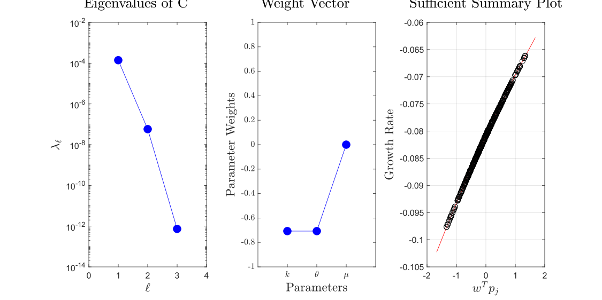
#### Kappa $(\kappa=1)$ with 10% Variation
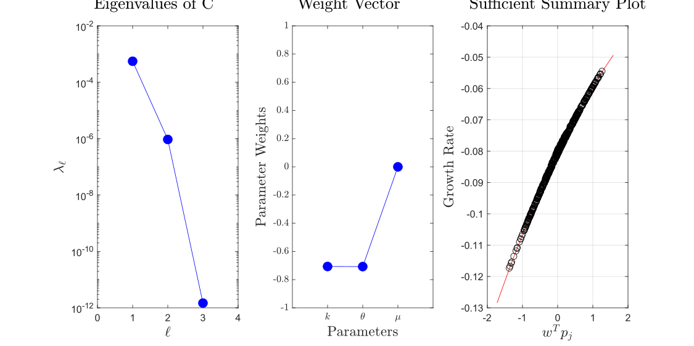
#### Kappa $(\kappa=1)$ with 15% Variation
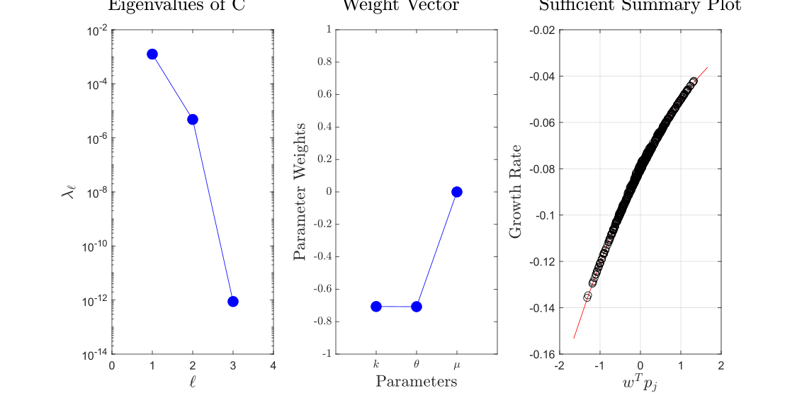
#### Kappa $(\kappa=1)$ with 25% Variation
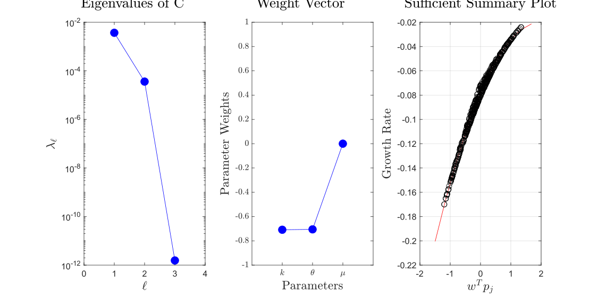
#### Kappa $(\kappa=1)$ with 50% Variation
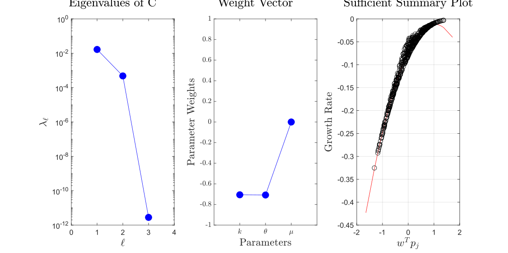

### Kappa = 2
#### Kappa $(\kappa=2)$ with 1% Variation

#### Kappa $(\kappa=2)$ with 5% Variation
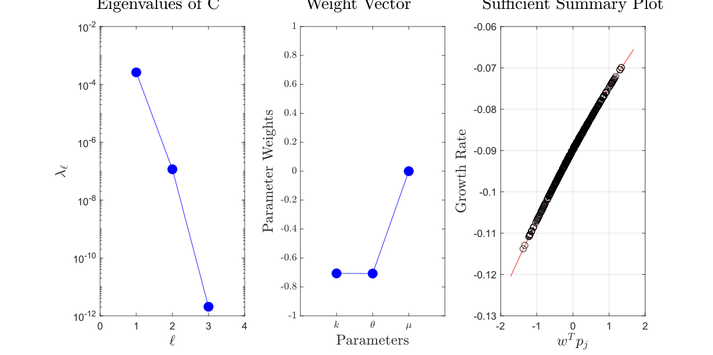
#### Kappa $(\kappa=2)$ with 10% Variation
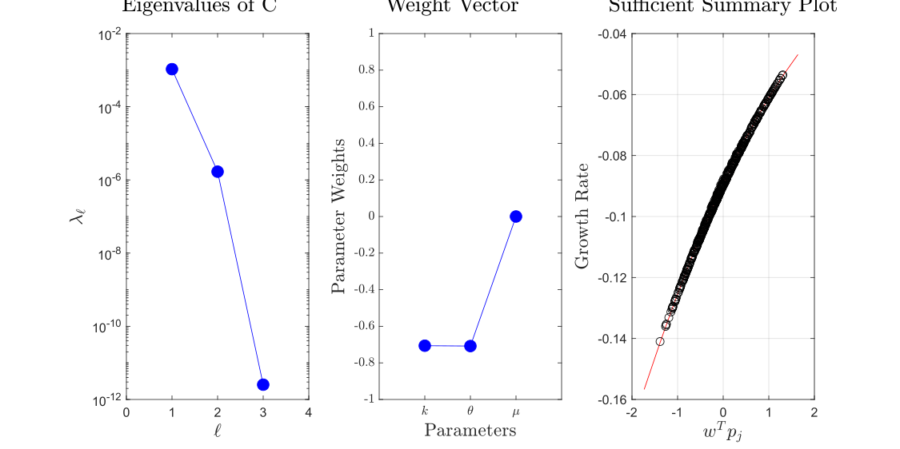
#### Kappa $(\kappa=2)$ with 15% Variation
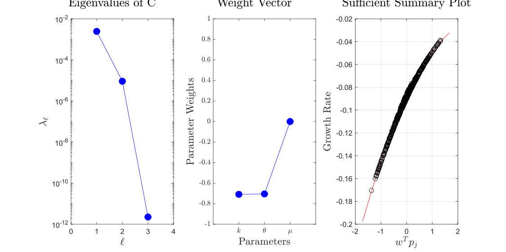
#### Kappa $(\kappa=2)$ with 25% Variation
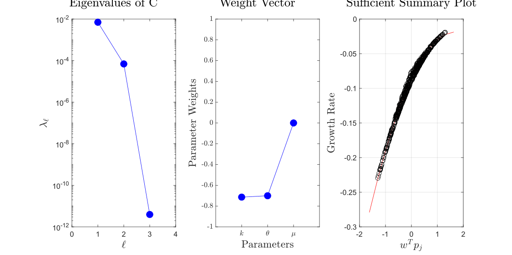
#### Kappa $(\kappa=2)$ with 50% Variation
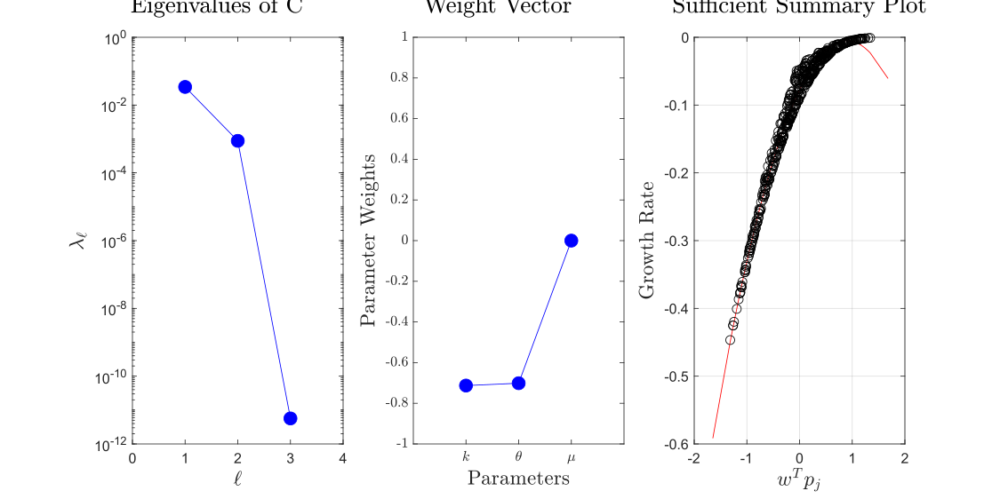

### Kappa = 6
#### Kappa $(\kappa=6)$ with 1% Variation

#### Kappa $(\kappa=6)$ with 5% Variation
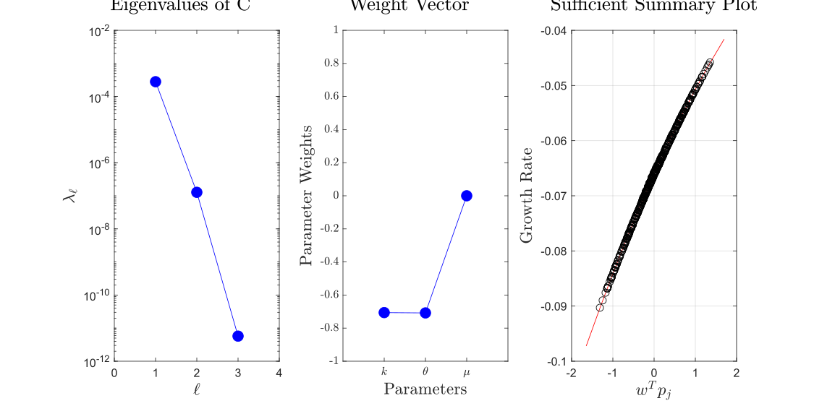
#### Kappa $(\kappa=6)$ with 10% Variation
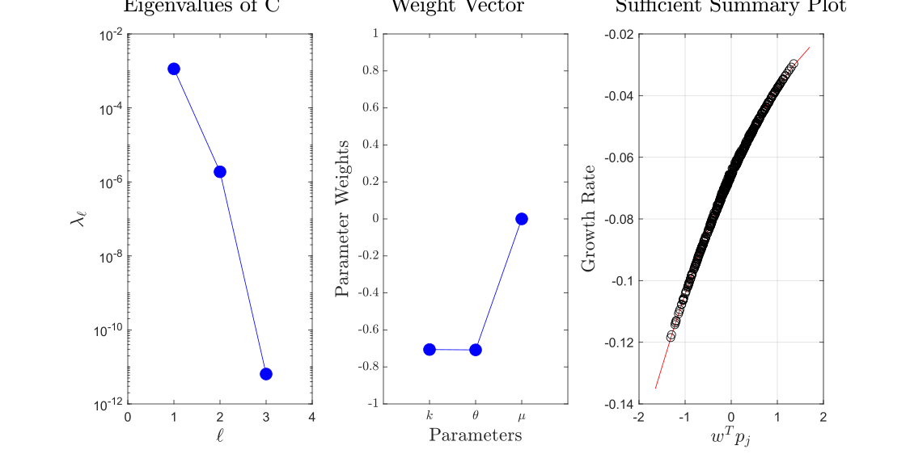
#### Kappa $(\kappa=6)$ with 15% Variation
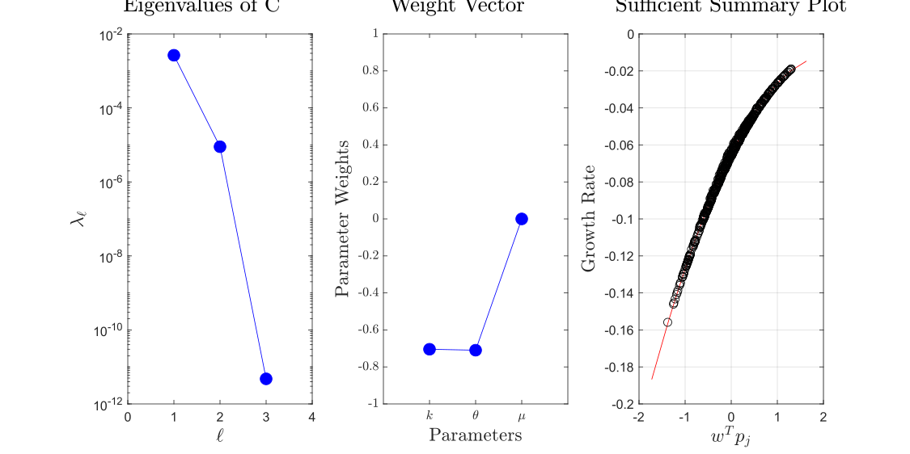
#### Kappa $(\kappa=6)$ with 25% Variation
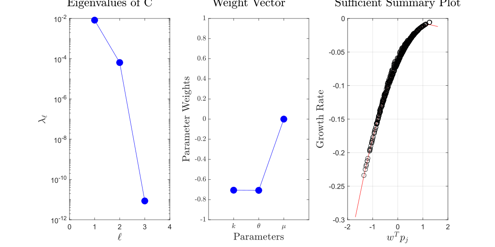
#### Kappa $(\kappa=6)$ with 50% Variation
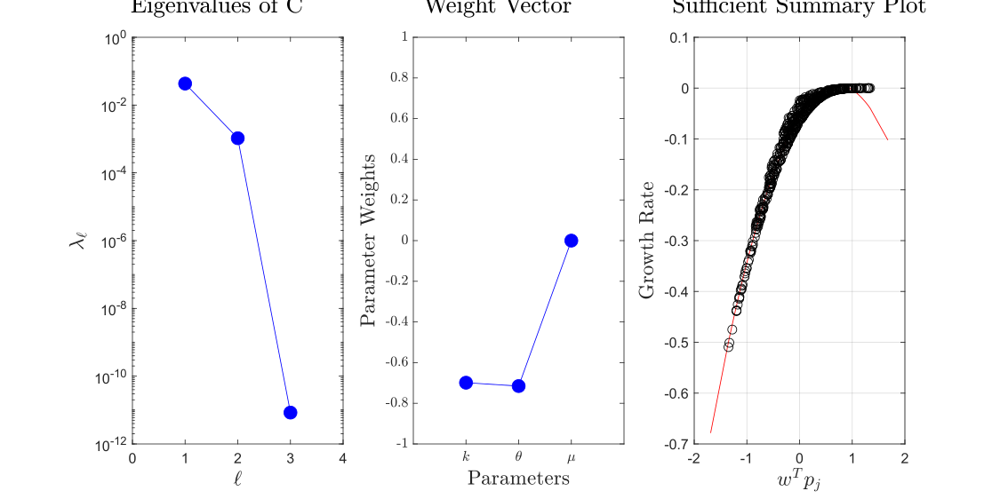
