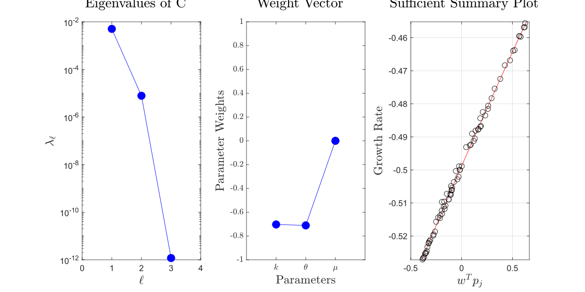

# README

## Sub-Folders:
- Maxwellian [empty]
- BiMaxwellian [empty]
- 1D Kappa [complete]
- 1D BiKappa [complete]
- Projected1D Kappa [complete]
- Projected1D BiKappa [empty]

#### 1D Kappa with 10% variation

#### Projected 1D Kappa with 10% variation

