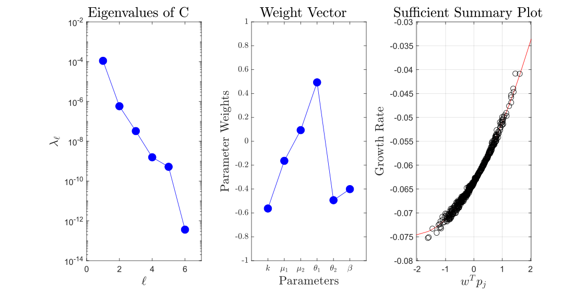
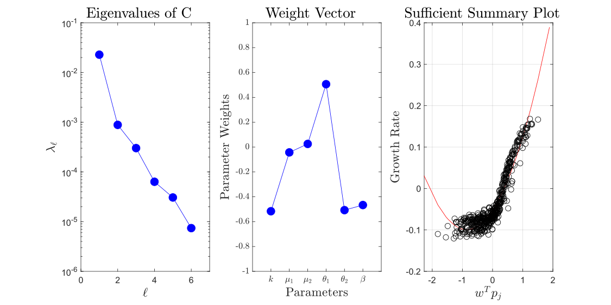
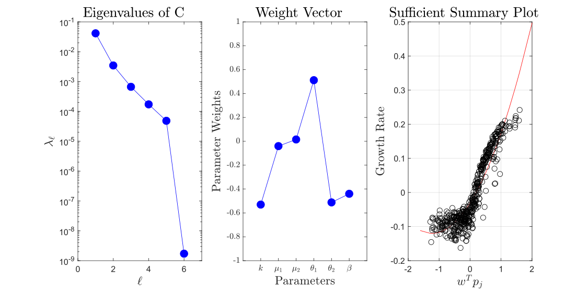
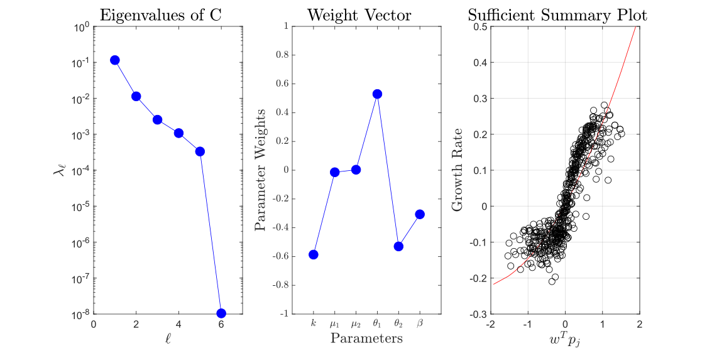
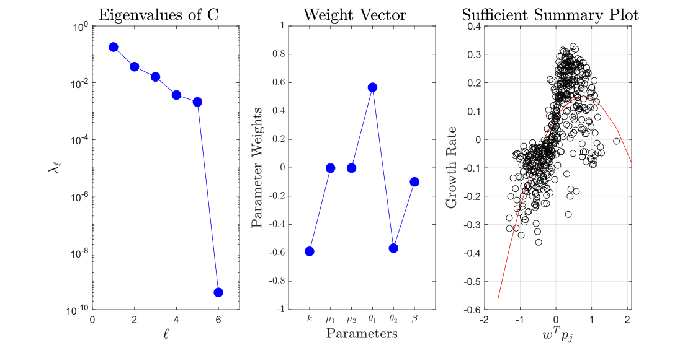

# README

## Sub-Folders:
- 1D BiMaxwellian $f_{BM}(v) = \frac{\beta}{\sqrt{\pi\sigma_1^2}}\text{exp}\left[-\frac{|v-\mu_1|^2}{\sigma_1^2}\right] + \frac{1-\beta}{\sqrt{\pi\sigma_2^2}}\text{exp}\left[-\frac{|v-\mu_2|^2}{\sigma_2^2}\right]$
- 1D Kappa $f_{\kappa}(v) = \frac{1}{\sqrt{\pi\theta^2\left(\kappa-\frac{1}{2}\right)}}\frac{\Gamma(\kappa+1)}{\Gamma(\kappa+1/2)}\left[1+\frac{1}{\kappa-\frac{1}{2}}\frac{({v}-{\mu})^2}{\theta^2}\right]^{-\kappa-1}$
- 1D BiKappa $f_{B\kappa}(v) = \frac{\beta}{\sqrt{\pi\theta_1^2\left(\kappa-\frac{1}{2}\right)}} \frac{\Gamma(\kappa+1)}{\Gamma(\kappa+1/2)}\left[1+\frac{1}{\kappa-\frac{1}{2}}\frac{({v}-{\mu_1})^2}{\theta_1^2}\right]^{-\kappa-1} + \frac{1-\beta}{\sqrt{\pi\theta_2^2\left(\kappa-\frac{1}{2}\right)}}   \frac{\Gamma(\kappa+1)}{\Gamma(\kappa+1/2)}\left[1+\frac{1}{\kappa-\frac{1}{2}}\frac{({v}-{\mu_2})^2}{\theta_2^2}\right]^{-\kappa-1}$
- SummersThorne/1D $f_{\kappa ST}(v)=\frac{1}{\sqrt{\pi\theta^2\kappa^3}}\frac{\Gamma(\kappa+1)}{\Gamma(\kappa-1/2)}\left[1+\frac{v^2}{\kappa\theta^2}\right]^{-\kappa}$

## Sufficient Summary Plots

#### Bi-Kappa $(\kappa=1)$ with 1% Variation

#### Bi-Kappa $(\kappa=1)$ with 5% Variation

#### Bi-Kappa $(\kappa=1)$ with 10% Variation

#### Bi-Kappa $(\kappa=1)$ with 15% Variation

#### Bi-Kappa $(\kappa=1)$ with 25% Variation

#### Bi-Kappa $(\kappa=1)$ with 50% Variation

