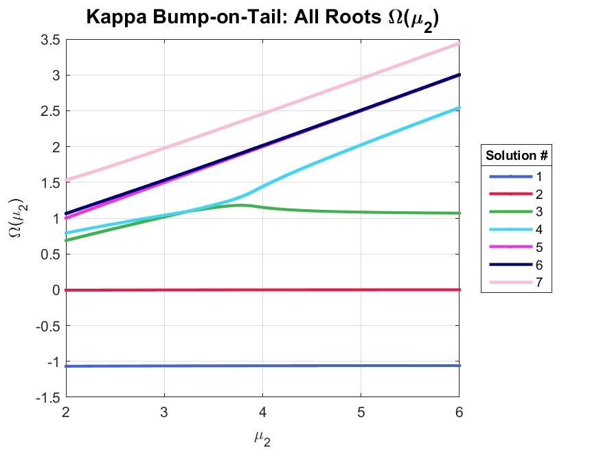

# Level Curves of All Solutions for All Parameters
**Base paramter set:** $\kappa=1$, $\beta=0.9$, $\mu_1=0$, $\mu_2=4$, $\theta_1=1$, $\theta_2=1$.  

**Updates to code:** Restricted set of roots to only ones where $|F(z_i)|<tol$, with $tol\approx 3$, and where the derivative at $0.9*kMax<dtol$ where $dtol\approx 0.3$.

  

  

  

  

  

  

