## Gamma Level Curves (for all parameters)

Parameter values:
$k = 0.5$
$\beta = 0.9$
$\mu_1 = 0$
$\mu_2 = 4$
$\theta_1 = 1$
$\theta_2 = 1$

### $k \in [0.1,1]$

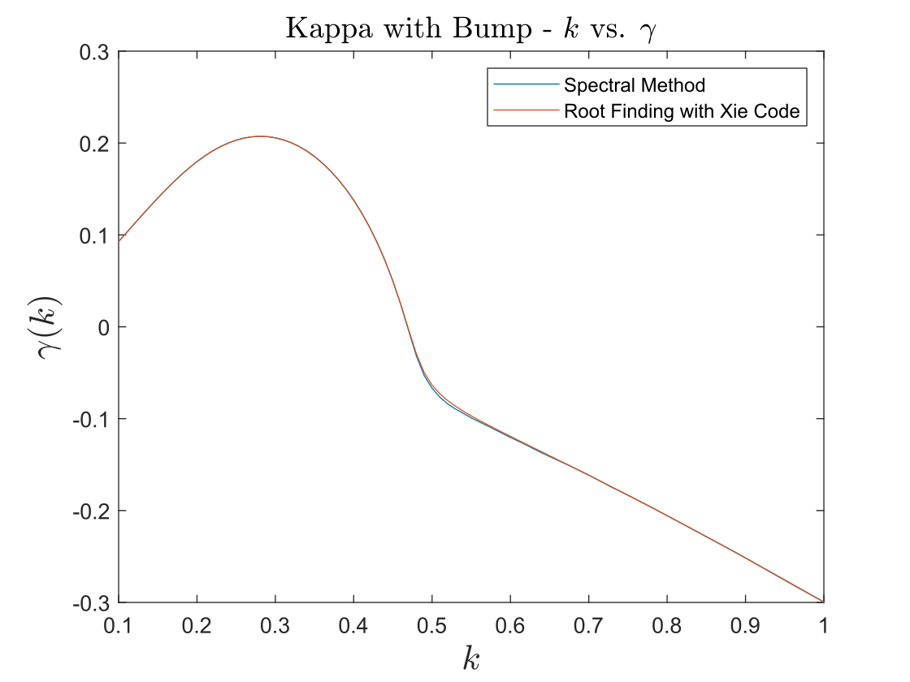

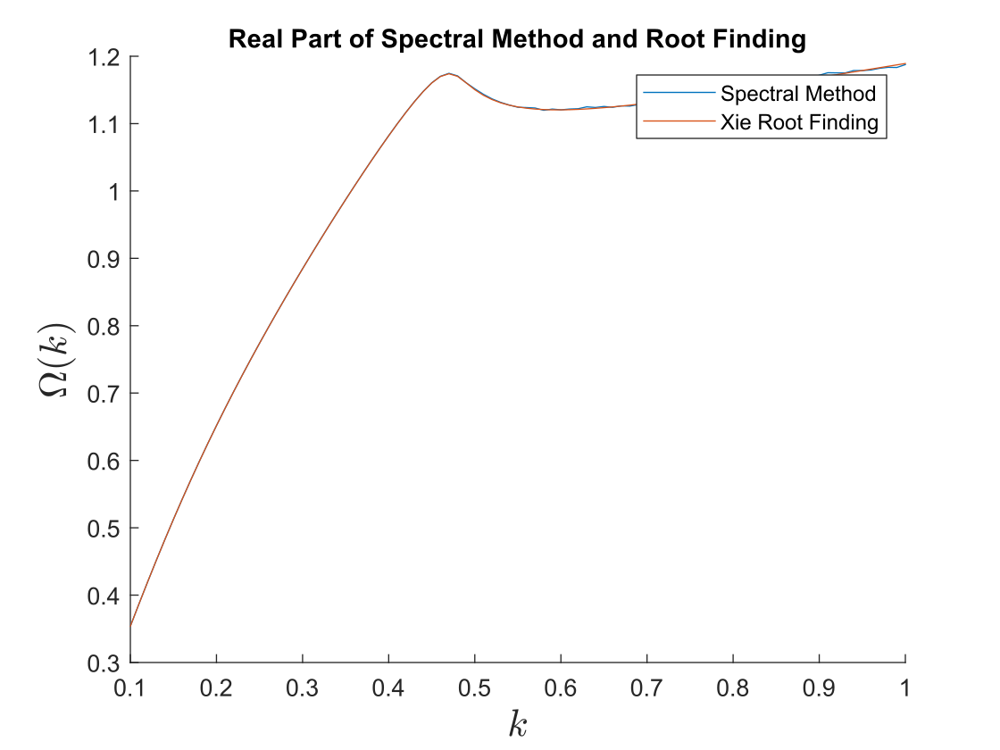

### $\beta \in [0.5,0.9]$

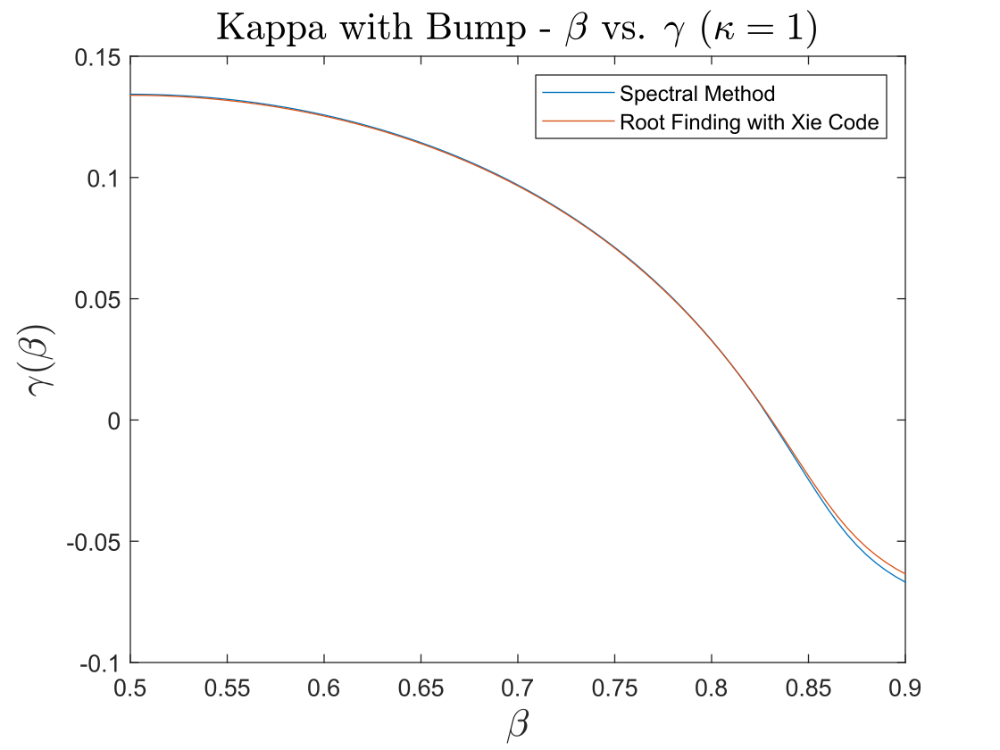

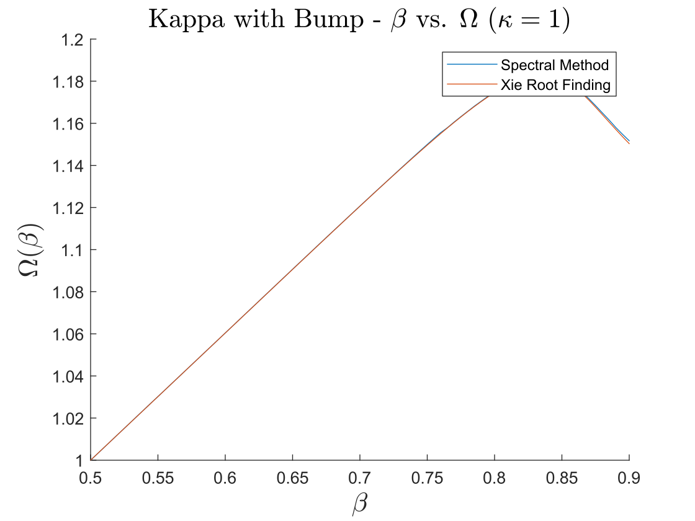

### $\mu_1 \in [-2,2]$

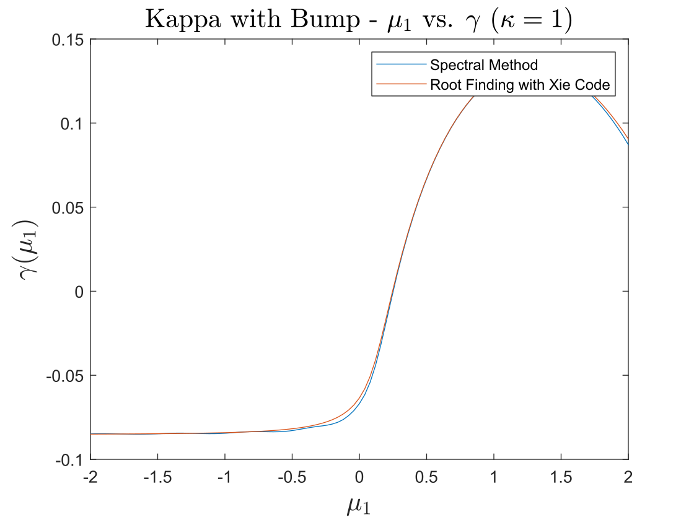

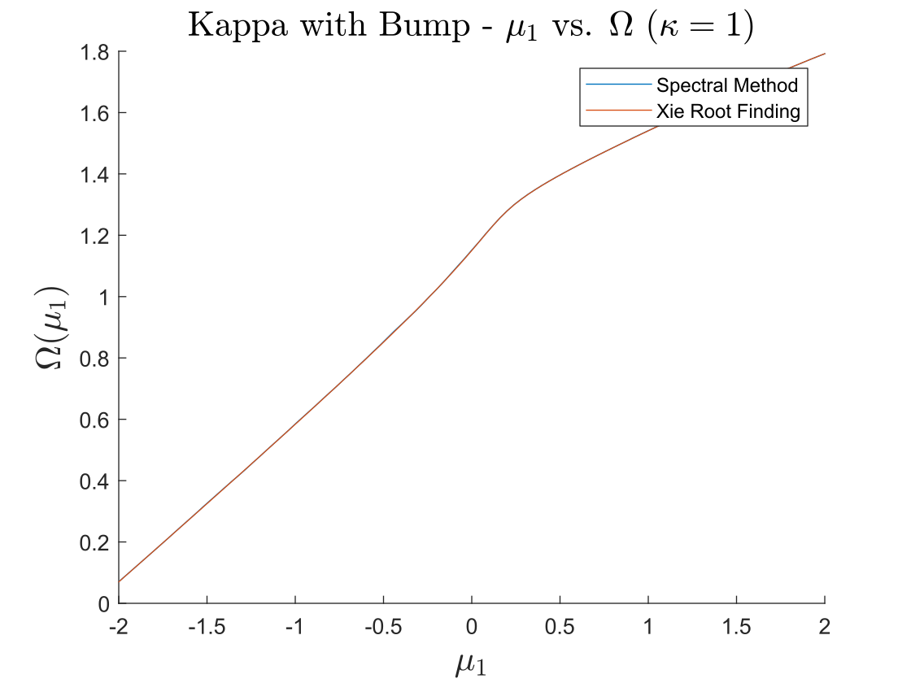

### $\mu_2 \in [2,6]$

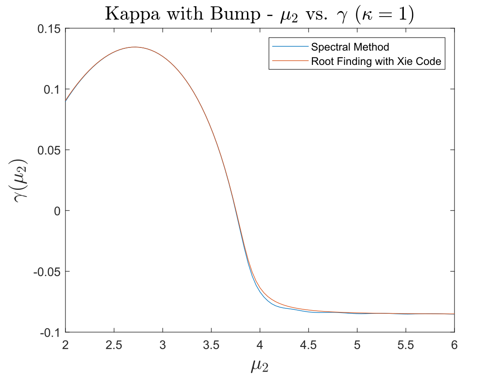

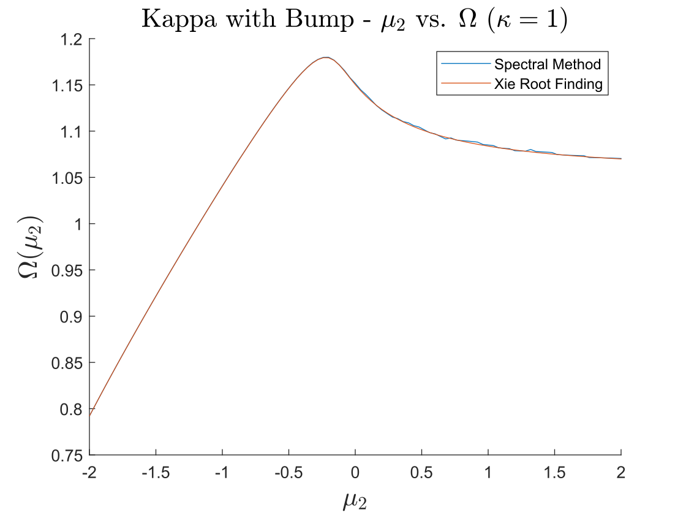

### $\theta_1 \in [0.5,1.5]$

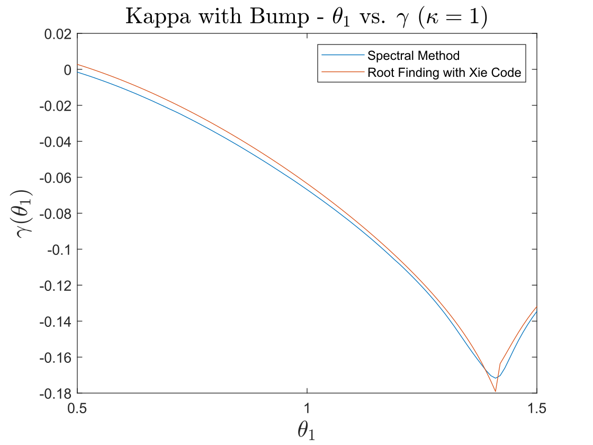

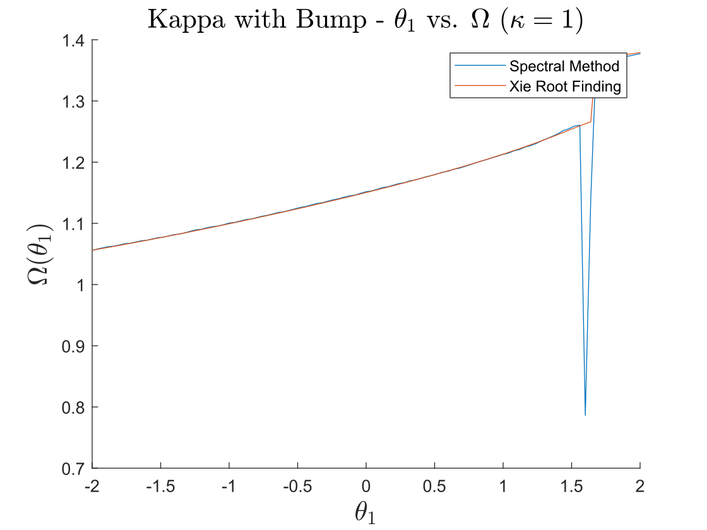

### $\theta_2 \in [0.5,1.5]$

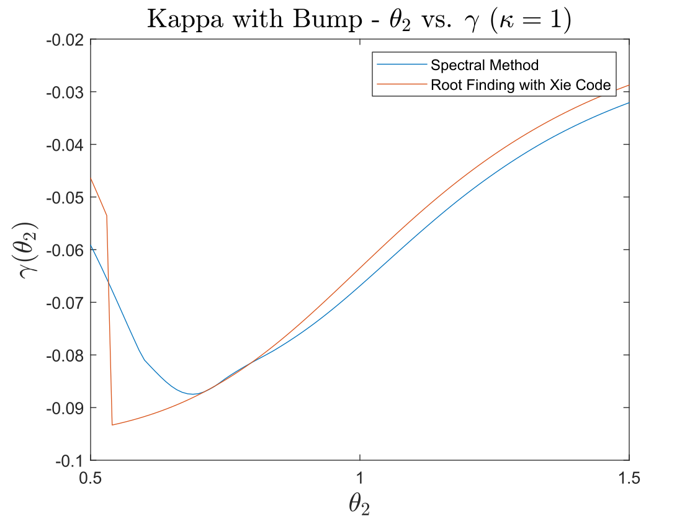

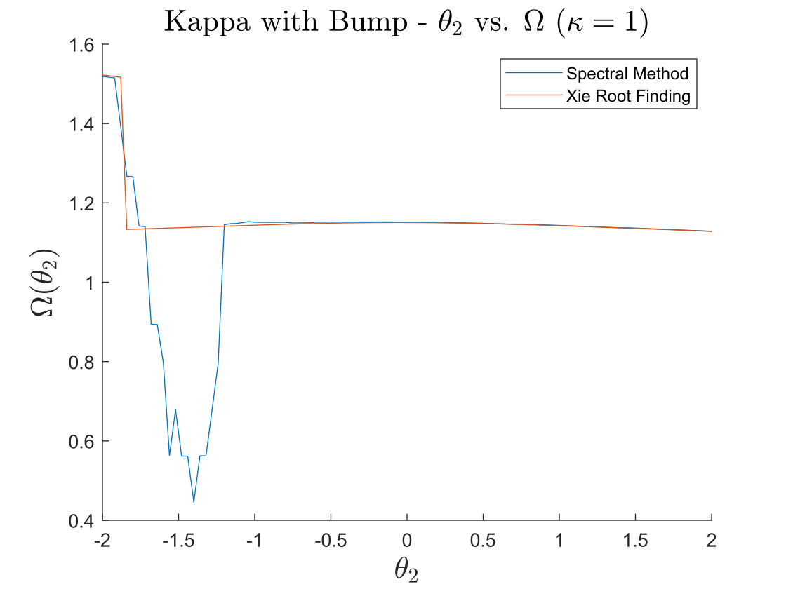
