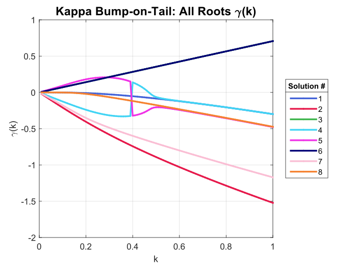
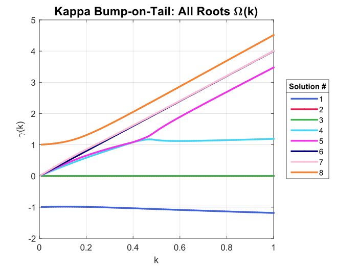

# Kappa Bump-on-Tail: Rate of Instability Code
Ben's code uploaded from OneDrive March 6, 2023 3:35 PM.  
Kappa distribution used:

$$f_\kappa(v;\mu_i,\theta_i)=\frac{1}{\sqrt{\pi\theta_i^2(\kappa-1/2)}}\frac{\Gamma(\kappa+1)}{\Gamma(\kappa+1/2)}\left[1+\frac{(v-\mu_i)^2}{\theta_i^2(\kappa-1/2)}\right]^{-\kappa-1}$$

Dispersion relation:

$$1-\frac{\beta}{k^2}\int_{-\infty}^\infty \frac{f'_{\kappa}(v;\mu_1,\theta_1)}{v-\omega/k}dv-\frac{1-\beta}{k^2}\int_{-\infty}^\infty \frac{f'_{\kappa}(v;\mu_2,\theta_2)}{v-\omega/k}dv=0$$

## Figures for Meeting 3/9/2023
All roots found in Mathematica for multiple $k$ values for Kappa Bump-on-Tail with $\kappa=1$, $\beta=0.9$, $\mu_1=0$, $\mu_2=4$, $\theta_1=\theta_2=1$.

## Figures for Meeting 3/6/2023
Current versions of code:
1. Xie (Weideman) algorithm with root finding using spectral method as initial guess for each $k$
2. Xie (Weideman) algorithm with root finding using previous $\gamma$ as initial guess for each $k$
3. Spectral method returning $\gamma$ for each $k$ (using as baseline)

### Spectral Method vs. Xie (with SM initial guess), $\gamma$ vs $k$
Figure generated from `Kappa_bump_level_curves.m`.

### Spectral Method vs. Xie (with SM initial guess), $\text{Re}(\omega)$ vs $k$
Figure generated from `Kappa_bump_level_curves.m`.

### Spectral Method vs. Xie (with previous $\omega$ as initial guess), $\gamma$ vs $k$
Figure generated from `Kappa_bump_level_curves_v2.m`.

### Spectral Method vs. Xie (with previous $\omega$ as initial guess), $\text{Re}(\omega)$ vs $k$
Figure generated from `Kappa_bump_level_curves_v2.m`.

