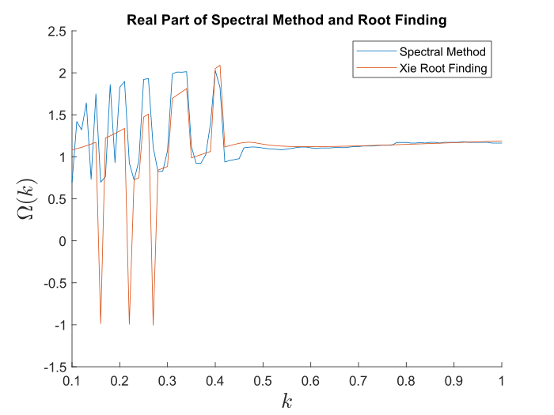
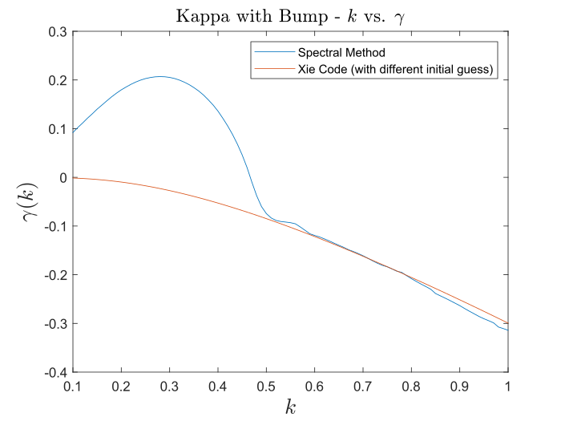
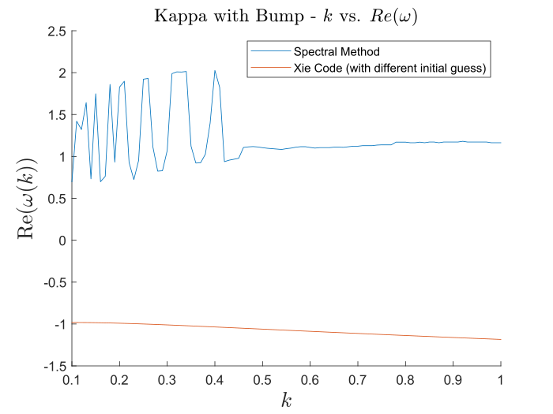

# Kappa Bump-on-Tail - Rate of Instability Code
Ben's code uploaded from OneDrive March 6, 2023 3:35 PM.

Current versions of code:
1. Xie (Weideman) algorithm with root finding using spectral method as initial guess for each $k$
2. Xie (Weideman) algorithm with root finding using previous $\gamma$ as initial guess for each $k$
3. Spectral method returning $\gamma$ for each $k$ (using as baseline)

### Spectral Method vs. Xie (with SM initial guess), $\gamma$ vs $k$
Figure generated from `Kappa_bump_level_curves.m`.

### Spectral Method vs. Xie (with SM initial guess), $\text{Re}(\omega)$ vs $k$
Figure generated from `Kappa_bump_level_curves.m`.

### Spectral Method vs. Xie (with previous $\omega$ as initial guess), $\gamma$ vs $k$
Figure generated from `Kappa_bump_level_curves_v2.m`.

### Spectral Method vs. Xie (with previous $\omega$ as initial guess), $\text{Re}(\omega)$ vs $k$
Figure generated from `Kappa_bump_level_curves_v2.m`.

