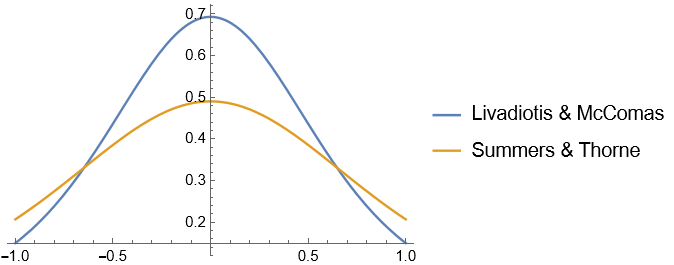

## Which 1D Kappa Distribution is the "Right" One?

### **Contender #1:** Livadiotis and McComas (2013)

$$\begin{align}
f_\kappa(v;\mu,\theta)=\frac{1}{\sqrt{\pi\theta^2(\kappa-1/2)}}\frac{\Gamma(\kappa+1)}{\Gamma(\kappa+1/2)}\left[1+\frac{|v-\mu|^2}{(\kappa-1/2)\theta^2}\right]^{-\kappa-1}
\end{align}$$

with $\theta=\sqrt{\frac{2k_B T}{m}}$.

### **Contender #2:** Summers and Thorne (1991)

**1D:**

$$\begin{align}
f_\kappa(v;\mu,\theta)=\frac{1}{\sqrt{\pi\theta^2\kappa^3}}\frac{\Gamma(\kappa+1)}{\Gamma(\kappa-1/2)}\left[1+\frac{|v-\mu|^2}{\kappa\theta^2}\right]^{-\kappa}
\end{align}$$

with $\theta=\sqrt{\frac{2\kappa-3}{\kappa}}\sqrt{\frac{T}{m}}$.

**3D:**

$$\begin{align}
f_\kappa(v;\mu,\theta)=\frac{1}{\sqrt{\pi^3\kappa^3}\theta^3}\frac{\Gamma(\kappa+1)}{\Gamma(\kappa-1/2)}\left[1+\frac{|v-\mu|^2}{\kappa\theta^2}\right]^{-(\kappa+1)}
\end{align}$$

with $\theta=\sqrt{\frac{2\kappa-3}{\kappa}}\sqrt{\frac{T}{m}}$.

### S. Sarkar, S. Paul, R. Denra (2015)

The kappa equilibrium distribution used is the 3D Summers and Thorne in cartesian coordinates and zero mean:

$$\begin{align}
f_{\kappa}(v_x,v_y,v_z) = (\pi \theta^2\kappa)^{-3/2}\frac{\Gamma(\kappa+1)}{\Gamma(\kappa-1/2)}\left[1+\frac{v_x^2+v_y^2+v_z^2}{\kappa\theta^2}\right]^{-(\kappa+1)}
\end{align}$$

with $\theta=\sqrt{\frac{(2\kappa-3)k_B T}{\kappa m}}$ for $2<\kappa<6$.

### 1D Plot with $\kappa=1$:

### Conclusion: 
Either one since they are both normalized and valid equilibrium distributions, but the Livadiotis one has a thermal temperature independent of $\kappa$.
