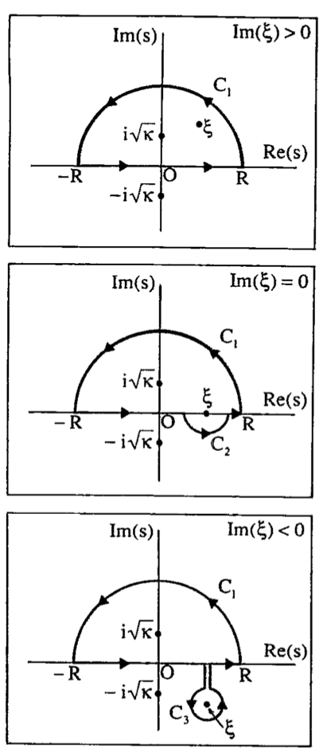

# Summaries of Papers
**Grace Mattingly**  
**July 11, 2023**

## On the Vibrations of the Electrostatic Plasma, Lev Landau (1946)
Governing equations are Vlasov-Poisson for an electron plasma with neutralizing ionic background projected along the $x$ direction. He takes the Fourier transform in $x$ and Laplace transform in $t$ of both the kinetic equation and potential integral, resulting in the following solution in the form of an inverse Laplace transform:

$$\begin{align}\displaystyle 
\phi(t) = \frac{1}{2\pi i}\int_{\delta-i\infty}^{\delta+i\infty}\frac{\frac{4\pi e}{k^2}\int_{-\infty}^\infty \frac{g(v)}{s+ikv}dv}{1-\frac{4\pi i e^2}{k m}\int_{-\infty}^\infty \frac{df_0(v)}{dv}\frac{dv}{s+ikv}} e^{-st}ds.
\end{align}$$

The vertical line $\delta\in\mathbb{R}$ is defined so that all of the poles of $\displaystyle F(s)=\frac{\frac{4\pi e}{k^2}\int_{-\infty}^\infty \frac{g(v)}{s+ikv}dv}{1-\frac{4\pi i e^2}{k m}\int_{-\infty}^\infty \frac{df_0(v)}{dv}\frac{dv}{s+ikv}}$ are to the left of the line. 

As the Laplace transform is defined only for $\text{Re}(s)>0$, we must analytically continue the function $F(s)$ into the left half complex $s$-plane.
Doing this means the pole $v=is/k$ moves from the upper half complex $v$-plane into the lower half plane. The analytic continuation must be applied to this pole as well. Thus the integrals over the real line of $v$ become deformed to include the pole $v=is/k$ in the upper half plane. 
***
## Understanding Kappa Distributions: A Toolbox for Space Science and Astrophysics, Livadiotis and McComas (2013)
In this toolbox, they define the kappa index $\kappa$ as
dependent on the system’s kinetic degrees of freedom $f$ through a fundamental kappa index $\kappa_0$ by

$$\begin{align}
\kappa(f)=\kappa_0+\frac{1}{2}f.
\end{align}$$

This relationship was supposedly (need to do more reading) estabilished in their 2011b paper. The kinetic degrees of freedom can be separated into the number of particles $N$ times the kinetic degrees of freedom per particle $d$: $f=N\cdot d$. In a 3D system modeling 1 particle, $f=3$ and $\kappa=\kappa_0+\frac{3}{2}$. Similarly, in a 1D system modeling 1 particle, $f=1$ and $\kappa=\kappa_0+\frac{1}{2}$.

Livadiotis and McComas define the $1$-Particle Kappa Distribution of Velocities as a $d$-dimensional distribution, meaning it applies to the $d$-dimensional space of velocities, as:

$$\begin{equation}
    P(\mathbf{u};\mathbf{u}_b;\theta,\kappa_0) = (\pi\kappa_0\theta^2)^{-\frac{d}{2}}\frac{\Gamma(\kappa_0+1+\frac{d}{2})}{\Gamma(\kappa_0+1)}\left[1+\frac{1}{\kappa_0}\frac{(\mathbf{u}-\mathbf{u}_b)^2}{\theta^2}\right]^{-\kappa_0-1-\frac{d}{2}}
\end{equation}$$

where $\theta=\sqrt{\frac{2k_B T}{m}}$ (see pg. 187).

In 3D with $f=1\cdot d = 3$ and $\kappa=\kappa_0+\frac{3}{2}$, this becomes:

$$\begin{align}
    P(\mathbf{u};\mathbf{u}_b;\theta,\kappa) &= \left[\pi\theta^2\left(\kappa-\frac{3}{2}\right)\right]^{-\frac{3}{2}}\frac{\Gamma(\kappa+1)}{\Gamma(\kappa-1/2)}\left[1+\frac{1}{\kappa-\frac{3}{2}}\frac{(\mathbf{u}-\mathbf{u}_b)^2}{\theta^2}\right]^{-\kappa-1}\\
    &=\frac{1}{\sqrt{\pi^3(\kappa-3/2)^3}\theta^3}\frac{\Gamma(\kappa+1)}{\Gamma(\kappa-1/2)}\left[1+\frac{1}{\kappa-\frac{3}{2}}\frac{(\mathbf{u}-\mathbf{u}_b)^2}{\theta^2}\right]^{-\kappa-1}
\end{align}$$

In 1D with $f=1\cdot d = 1$ and $\kappa=\kappa_0+\frac{1}{2}$, this becomes: **(this is the one we have been using)**

$$\begin{equation}
    P({u};{u}_b;\theta,\kappa) = \left[\pi\theta^2\left(\kappa-\frac{1}{2}\right)\right]^{-\frac{1}{2}}\frac{\Gamma(\kappa+1)}{\Gamma(\kappa+1/2)}\left[1+\frac{1}{\kappa-\frac{1}{2}}\frac{({u}-{u}_b)^2}{\theta^2}\right]^{-\kappa-1}
\end{equation}$$

***
## Modified Dispersion Relation, Summers and Thorne (1991)

Summers and Thorne perform the same computation as Landau for the Lorentizian and Kappa distribution function in 3D (see equation below). Given the principle root $\xi=\frac{\omega_R+i\gamma}{k\theta}$, they define the *modified plasma dispersion function* for $\kappa\in\mathbb{Z}^+$ by 

$$\displaystyle Z_\kappa^*(\xi)=\frac{1}{\sqrt{\pi}}\frac{\Gamma(\kappa+1)}{\kappa^{3/2}\Gamma(\kappa-1/2)}\times \int_{-\infty}^\infty\frac{dv}{(v-\xi)(1+v^2/\kappa)^{\kappa+1}}$$

and call the integral $F(\xi)=\int_{-\infty}^\infty\frac{\phi(v)}{(v-\xi)}dv$ with  $\phi(v)=(v^2+\kappa)^{-(\kappa+1)}$. Then they extend $F(\xi)$
for $\xi$ in the lower half $v$-complex plane by:

$$F(\xi)=\begin{cases} \displaystyle 
\lim_{R\rightarrow\infty} \int_{-R}^R \frac{\phi(v)}{v-\xi}dv &\text{Im}(\xi)>0 \\ 
\lim_{R\rightarrow\infty,\epsilon\rightarrow 0} \left(\int_{-R}^{\xi-\epsilon} \frac{\phi(v)}{v-\xi}dv+\int_{\xi+\epsilon}^R \frac{\phi(v)}{v-\xi}dv\right) +\lim_{\epsilon\rightarrow 0} \int_{C_2} \frac{\phi(v)}{v-\xi}dv&\text{Im}(\xi)=0 \\  
\lim_{R\rightarrow\infty} \int_{-R}^R \frac{\phi(v)}{v-\xi}dv + \int_{C_3} \frac{\phi(v)}{v-\xi}dv&\text{Im}(\xi)<0
\end{cases}.$$ 

In each case the resulting formula is $F(\xi)=2\pi i \left[\text{Res}(i\sqrt{\kappa})+\text{Res}(\xi)\right]$. 
See the figure on the right for the contours. Their integration variable is $s$, while here I use $v$.

They provide a verification of these formulae using the Sokhotcki-Plemelj Theorem for the real line (citation needed):

$$\begin{align}\displaystyle 
\lim_{\delta\rightarrow 0^+}\int_{-\infty}^\infty \frac{\phi(v)}{v-\alpha+i\delta}dv = \mathcal{P}\int_{-\infty}^\infty\frac{\phi(v)}{v-\alpha}dv-i\pi\phi(\alpha)\\
\lim_{\delta\rightarrow 0^+}\int_{-\infty}^\infty \frac{\phi(v)}{v-\alpha-i\delta}dv = \mathcal{P}\int_{-\infty}^\infty\frac{\phi(v)}{v-\alpha}dv+i\pi\phi(\alpha)
\end{align}$$

where $\mathcal{P}$ is the Cauchy principle value of the integral. They also write explicit results of $Z_\kappa^*(\xi)$
for integer values of $\kappa\in [1,6]$.

$$\begin{align} \displaystyle
Z_{1}^{\*}(\xi)&=-(\xi/2+i)/(\xi+i)^2 \\
Z_{2}^{\*}(\xi)&=-(3\xi^2/4+9\sqrt{2}i\xi/4-4)/(\xi+\sqrt{2}i)^3
\end{align}$$

They also give general results for $\xi=0$, $\xi\rightarrow 0$, and $|\xi|\rightarrow \infty$ by power series (convergent for $|\xi|<\sqrt{\kappa}$ and $|\xi|>\sqrt{\kappa}$). Additionally, they provide a recursion relation between $Z_{\kappa+1}^{\*}(\xi)$ 
and $Z_\kappa^{\*}(\xi)$ using the derivative with respect to $\xi$. 

Finally, applying this to Vlasov-Poisson, they give the following as the dispersion relation for the kappa distribution function:
$$1+\frac{2\omega_p^2}{k^2\theta^2}\left[1-\frac{1}{2\kappa}+\frac{\omega}{k\theta}Z_\kappa^{\*}\left(\frac{\omega}{k\theta}\right)\right]=0$$
where $\theta=[(2\kappa-3)/\kappa]^{1/2}(T/m)^{1/2}$ is the electron thermal speed, $\omega=\omega_R+i\gamma$ is the wave frequency, and $\omega_p=(4\pi i e^2/m)^{1/2}$ is the electron plasma frequency. They published an accompanying paper with more details for this. 

Note the relationships between the plasma dispersion function $Z(\xi)$, the Fadeeva function $w(\xi)$, and the complex error function $\text{erf}(i\xi)$.

$$\begin{align}
Z(\xi)&=\frac{1}{\sqrt{\pi}}\int_{-\infty}^\infty \frac{e^{-v^2}}{v-\xi}dv, \text{Im}(\xi)>0 \\
w(\xi)&=\frac{1}{i\sqrt{\pi}}Z(\xi) \\
Z(\xi)&=i\sqrt{\pi}e^{-\xi^2}\left[1+\text{erf}(i\xi)\right]
\end{align}$$

##### Kappa Distribution
The distributions which Summers and Thorne (1991) say are the 3D and 1D 1-particle distribution fucntions are:

$$\begin{align}
    f_{\kappa} (\mathbf{v};\theta,\kappa)&= \frac{1}{\sqrt{\pi^3\kappa^3}\theta^3}\frac{\Gamma(\kappa+1)}{\Gamma(\kappa-1/2)}\left[1+\frac{\mathbf{v}^2}{\kappa\theta^2}\right]^{-(\kappa+1)} \\
    f_{\kappa}(v;\theta,\kappa) &= \frac{1}{\sqrt{\pi\kappa^3}\theta}\frac{\Gamma(\kappa+1)}{\Gamma(\kappa-1/2)}\left[1+\frac{v^2}{\kappa\theta^2}\right]^{-\kappa}
\end{align}$$

where $\theta=\sqrt{\frac{2\kappa-3}{\kappa}}\sqrt{\frac{T}{m}}$ (see pg. 1835).

***
## Kappa Distributions, From Observational Evidences via Controvesial Predictions to a Consistent Theory of Nonequilibrium Plasmas, Fichtner and Lazar (2021)
In the introduction of this editorial from the Astrophysics and Space Science Library, H. Fichtner and M. Lazar describe three versions of the kappa distributions which have been conjectured and studied. 

The first proposed in 1968 by Olbert they call the *Olbertian*. It was motivated by magnetospheric electron spectral measurements and is characterized by a $\kappa$-dependent tail and a thermal velocity parameter $\theta$. An anisotropic version was introduced with thermal velocities parallel and perpendicular to an external magnetic field, 

$$\begin{align}
    \theta_{\|} &= \sqrt{\frac{2k_B T_{M\|}}{m}}\\
    \theta_{\perp} &= \sqrt{\frac{2k_B T_{M\perp}}{m}}
\end{align}$$

The temperature used to define the thermal velocities are the equilibrium Maxwellian temperatures and are related to the corresponding $\kappa$-dependent temperatures via 

$$\begin{align}
    T_{\kappa \|}&=\frac{m}{k_B}\int v_{\|}^2f_\kappa(v_{\|},v_{\perp})d^3v = \frac{m}{2k_B}\frac{2\kappa}{2\kappa-3}\theta_{\|}^2 \geq T_{M\|}\\
    T_{\kappa \perp}&=\frac{m}{2k_B}\int v_{\perp}^2f_\kappa(v_{\|},v_{\perp})d^3v = \frac{m}{2k_B}\frac{2\kappa}{2\kappa-3}\theta_{\perp}^2\geq T_{M\perp}
\end{align}$$

The Olbertian is defined here as 

$$\begin{equation}
    \boxed{f_{\kappa}(v;\theta_{\|},\theta_\perp) = \frac{1}{\pi^{3/2}\theta_\perp^2\theta_{\|}} \frac{\Gamma[\kappa+1]}{\Gamma[\kappa-1/2]} {\left[1+\frac{v_{\|}^2}{\kappa\theta_{\|}^2} + \frac{v_\perp^2}{\kappa\theta_\perp^2}\right]}^{-(\kappa+1)} }
\end{equation}$$

A distribution complementary to the Olbertian was defined later with $\kappa$-independent temperatures, $T_{\|}$ and $T_\perp$. This distribution is known as the *modified Kappa* and is defined here as:

$$\begin{align}
    \boxed{f_{\kappa}(v;T_{\|},T_\perp)={\left(\frac{m}{\pi k_B (2\kappa-3)}\right)}^{3/2}\frac{1}{T_\perp\sqrt{T_{\|}}} \frac{\Gamma[\kappa+1]}{\Gamma[\kappa-1/2]}  {\left[1+\frac{m}{k_B(2\kappa-3)}\left(\frac{v_{\|}^2}{T_{\|}}+\frac{v_{\perp}^2}{T_\perp}\right)\right]}^{-(\kappa+1)} }
\end{align}$$

According to Fichtner and Lazar, The Summers and Thorne (1991) paper quotes the formulae for the Olbertian, but plot the modified Kappa. Additionally, they say Livadiotis (2015) argues that the modified Kappa is the physically correct one in all cases, but they dispute that claim in Lazar et al. (2015,2016), conjugating that the modified Kappa can lead to inconsistent results in the context of linear dispersion theory and that the Olbertian should be used in those cases. 

***
## Computation of the Complex Error Function, J.A.C. Weideman (1994)
The above relationships give the following relations:

$$\begin{align}
w(\xi)&=e^{-\xi^2}\left[1+\text{erf}(i\xi)\right]=e^{-\xi^2}\text{erfc}(-i\xi) \\
w(\xi)&=\frac{i}{\pi}\int_{-\infty}^\infty \frac{e^{-v^2}}{\xi-v}dv, \text{Im}(\xi)>0
\end{align}$$

This paper builds an algorithm to compute $w(\xi)$ based on the integral representation. Weideman starts by assuming the existence of an expansion

$$[W(v)]^{-1}e^{-v^2}=\sum_{n=-\infty}^\infty a_n \psi_n(v), v\in\mathbb{R}$$

where $\{\psi_n(v)\}$ is an orthogonal basis set in $L_2(\mathbb{R};W(v))$ with appropriate weight function $W(v)$.
From this we can rearrange for the integrand of $w(\xi)$:

$$\begin{align}\displaystyle
\frac{e^{-v^2}}{\xi-v}=\sum_{n=-\infty}^\infty a_n \left[W(v) \frac{\psi_n(v)}{\xi-v}\right].
\end{align}$$
Integrate both sides term by term to get 

$$\begin{align}\displaystyle
w(\xi)=\sum_{n=-\infty}^\infty a_n \Psi_n(\xi), \hspace{1cm} \text{Im}(\xi)>0
\end{align}$$

where

$$\begin{align}\displaystyle
\Psi_n(\xi)=\frac{i}{\pi}\int_{-\infty}^\infty W(v)\frac{\psi_n(v)}{\xi-v}dv.
\end{align}$$

The paper consists of (1) introducing one set of basis functions $\psi_n(v)$, (2) deriving recurrence relations for $a_n$, (3) estimating asymptotics of decay of coefficients $a_n$.

### First Basis Set
$$\begin{align}\displaystyle
\sigma_n(v)=\left(\frac{L+iv}{L-iv}\right)^n
\end{align}$$

where $L\in\mathbb{R}^+$ is a parameter to be chosen for optimal accuracy. The set $\{\sigma_n(v)\}$ is complete and orthogonal in $L_2(\mathbb{R};W(v))$ with corresponding weight function $W(v)=\frac{1}{L^2+v^2}$.

Making the substitution $v=L\tan{\theta/2}$, $v\in[-\infty,\infty]$ is mapped to $\theta\in[-\pi,\pi]$, and this basis is the Fourier series with $\sigma_n(v)=e^{in\theta}$.

Let $f(v)=\sum_n a_n\sigma_n(v)$, then the coefficients are given by 

$$\begin{align}\displaystyle
a_n=\frac{L}{\pi}\int_{-\infty}^\infty \frac{f(v)}{L^2+v^2}\left(\frac{L-iv}{L+iv}\right)^n dv=\frac{L}{\pi}\int_{-\infty}^\infty e^{-v^2}\left(\frac{L-iv}{L+iv}\right)^n dv,
\end{align}$$

using that $F(v)=[W(v)]^{-1}e^{-v^2}=(L^2+v^2)e^{-v^2}$ in the equations above. The optimal parameter is $L=N^{1/2}2^{-1/4}$
where $N$ is the truncation of the Fourier series.

### Second Basis Set
$$\begin{align}\displaystyle
\rho_n(v)=\frac{1}{L-iv}\sigma_n(v)= \frac{1}{L-iv}\left(\frac{L+iv}{L-iv}\right)^n
\end{align}$$

These functions are complete and orthogonal in $L_2(\mathbb{R};W(v))$ with corresponding weight function $W(v)=1$. 
They write the expansion of $f(v)=e^{-v^2}=\sum_n b_n\rho(v)$ with coefficients given by

$$\begin{align}\displaystyle
b_n=\frac{L}{\pi}\int_{-\infty}^\infty \frac{f(v)}{L+iv}\left(\frac{L-iv}{L+iv}\right)^n dv=\frac{L}{\pi}\int_{-\infty}^\infty e^{-v^2}\frac{(L-iv)^n}{(L+iv)^{n+1}} dv.
\end{align}$$

They have the same optimal value of $L$ and the coefficients $b_n$ decay faster than $a_n$ due to the extra power of $v$ in the denominator.

***
## Generalized plasma dispersion relation, Xie (2013)
This paper applies the method from Weideman (1994) to various functions, listed below. He also provides Matlab files which does the computation.

$$\begin{align}
F_M&=\frac{1}{v_t\sqrt{\pi}}e^{-\frac{v^2}{v_t^2}} \\
F_\kappa&=A_\kappa \left[1+ \frac{1}{\kappa}\frac{v^2}{v_t^2}\right]^{-\kappa}, \hspace{0.5cm} A_\kappa=\frac{1}{v_t}\frac{\Gamma(\kappa)}{\Gamma(\kappa-1/2)}\frac{1}{\sqrt{\pi\kappa}} \\
F_\delta&=\delta(z-z_d) \\
F_{IM}&=H(v-\nu)\frac{1}{\sqrt{\pi}}e^{-v^2} \\
F_{FT}&=\frac{H(z-z_a)-H(z-z_b)}{z_b-z_a} \\
F_{Tri}&=\frac{H(z-z_a)-H(z-z_b)}{z_b-z_a}\frac{2(z-z_a)}{z_c-z_a}-\frac{H(z-z_b)-H(z-z_c)}{z_c-z_b}\frac{2(z-z_c)}{z_c-z_a} \\
F_{SD}&=\frac{3\sqrt{3}v_t^2}{4\pi}\frac{1}{|v|^3+v_t^3}H(v_c-|v|) \\
F_{BoTM}&=\frac{0.9}{\sqrt{\pi}}e^{-v^2}+\frac{0.1}{\sqrt{\pi}}e^{-(v-2)^2}
\end{align}$$

When applying these formulae, Xie gives two equations which are solved:

$$\begin{align}
Z(\xi)&=\int_C\frac{F}{z-\xi}dz \\
Z_{p}(\xi)&=\int_C\frac{\partial F/\partial z}{z-\xi}dz
\end{align}$$

where $C$ is the Landau integral contour. He notes that the dispersion relation is given by:

$$\begin{align}\displaystyle
D(\omega,k)=1-\frac{\omega_p^2}{k^2}\int_C \frac{\partial f_0/\partial v}{v-\omega/k}dv=0
\end{align}$$

where $k$ is the wave vector, $\omega=\omega_r+i\gamma$ is the frequency, and $\omega_p=\sqrt{\frac{4\pi n_0q^2}{m}}$ is the plasma frequency.

To apply the Weideman algorithm for the Lorentzian or Kappa distributions, we need to assume that Fourier expansions of the following functions exist:

$$\begin{align}
F_{L}(v)&=(L^2+v^2)\frac{v}{(v^2+1)^2} \\
F_{\kappa}(v)&=(L^2+v^2)\frac{v}{(v^2+\kappa)^{\kappa+2}}
\end{align}$$

***
