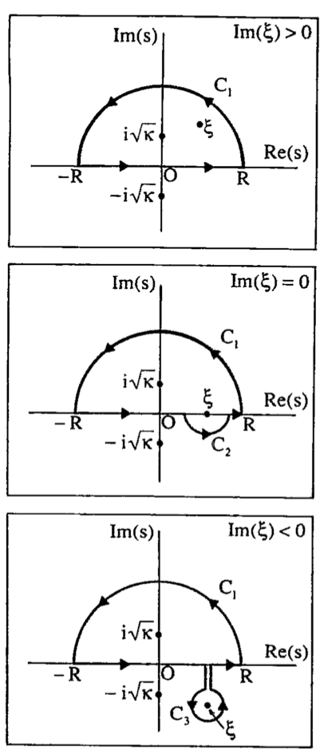

# Papers and Summaries
## On the Vibrations of the Electrostatic Plasma, Lev Landau (1946)
Governing equations are Vlasov-Poisson for an elecron plasma with neutralizing ionic background projected along the $x$ direction. He takes the Fourier transform in $x$ and Laplace transform in $t$ of both the kinetic equation and potential integral, resulting in the following solution in the form of an inverse Laplace transform:

$$\displaystyle \phi(t) = \frac{1}{2\pi i}\int_{\delta-i\infty}^{\delta+i\infty}\frac{\frac{4\pi e}{k^2}\int_{-\infty}^\infty \frac{g(v)}{s+ikv}dv}{1-\frac{4\pi i e^2}{k m}\int_{-\infty}^\infty \frac{df_0(v)}{dv}\frac{dv}{s+ikv}} e^{-st}ds.$$

The vertical line $\delta\in\mathbb{R}$ is defined so that all of the poles of $F(s)=\frac{\frac{4\pi e}{k^2}\int_{-\infty}^\infty \frac{g(v)}{s+ikv}dv}{1-\frac{4\pi i e^2}{k m}\int_{-\infty}^\infty \frac{df_0(v)}{dv}\frac{dv}{s+ikv}}$ are to the left of the line. 

As the Laplace transform is defined only for $\text{Re}(s)>0$, we must analytically continue the function $F(s)$ into the left half complex $s$-plane.
Doing this means the pole $v=is/k$ moves from the upper half complex $v$-plane into the lower half plane. The analytic continuation must be applied to this pole as well. Thus the integrals over the real line of $v$ become deformed to include the pole $v=is/k$ in the upper half plane. 
***
## Modified Dispersion Relation, Summers and Thorne (1991)
{max-height: 400px,float: right}
They perform the same computation as Landau for the Lorentizian and Kappa distribution functions in the 3D case projected into 1D. Given the principle root $\xi=\frac{\omega_R+i\gamma}{k\theta}$, they define the *modified plasma dispersion function* for $\kappa\in\mathbb{Z}^+$ by 

$$Z_\kappa^*(\xi)=\frac{1}{\sqrt{\pi}}\frac{\Gamma(\kappa+1)}{\kappa^{3/2}\Gamma(\kappa-1/2)}\times \int_{-\infty}^\infty\frac{dv}{(v-\xi)(1+v^2/\kappa)^{\kappa+1}}$$

and call the integral $F(\xi)=\int_{-\infty}^\infty\frac{\phi(v)}{(v-\xi)}dv$ with  $\phi(v)=(v^2+\kappa)^{-(\kappa+1)}$. Then they extend $F(\xi)$
for $\xi$ in the lower half $v$-complex plane by:

$$F(\xi)=\begin{cases} \displaystyle 
\lim_{R\rightarrow\infty} \int_{-R}^R \frac{\phi(v)}{v-\xi}dv &\text{Im}(\xi)>0 \\ 
\lim_{R\rightarrow\infty,\epsilon\rightarrow 0} \left(\int_{-R}^{\xi-\epsilon} \frac{\phi(v)}{v-\xi}dv+\int_{\xi+\epsilon}^R \frac{\phi(v)}{v-\xi}dv\right) +\lim_{\epsilon\rightarrow 0} \int_{C_2} \frac{\phi(v)}{v-\xi}dv&\text{Im}(\xi)=0 \\  
\lim_{R\rightarrow\infty} \int_{-R}^R \frac{\phi(v)}{v-\xi}dv + \int_{C_3} \frac{\phi(v)}{v-\xi}dv&\text{Im}(\xi)<0
\end{cases}.$$ 

In each case the resulting formula is $F(\xi)=2\pi i \left[\text{Res}(i\sqrt{\kappa})+\text{Res}(\xi)\right]$. 
See the figure on the right for the contours. Their integration variable is $s$, while here I use $v$.

They provide a verification of these formulae using the Sokhotcki-Plemelj Theorem for the real line (citation needed):
$$\displaystyle \lim_{\delta\rightarrow 0^+}\int_{-\infty}^\infty \frac{\phi(v)}{v-\alpha+i\delta}dv = \mathcal{P}\int_{-\infty}^\infty\frac{\phi(v)}{v-\alpha}dv-i\pi\phi(\alpha)$$
$$\displaystyle \lim_{\delta\rightarrow 0^+}\int_{-\infty}^\infty \frac{\phi(v)}{v-\alpha-i\delta}dv = \mathcal{P}\int_{-\infty}^\infty\frac{\phi(v)}{v-\alpha}dv+i\pi\phi(\alpha)$$
where $\mathcal{P}$ is the Cauchy principle value of the integral. They also write explicit results of $Z_\kappa^*(\xi)$
for integer values of $\kappa\in [1,6]$.

$$Z_{1}^{\*}(\xi)=-(\xi/2+i)/(\xi+i)^2$$
$$Z_{2}^{\*}(\xi)=-(3\xi^2/4+9\sqrt{2}i\xi/4-4)/(\xi+\sqrt{2}i)^3$$

They also give general results for $\xi=0$, $\xi\rightarrow 0$, and $|\xi|\rightarrow \infty$ by power series (convergent for $|\xi|<\sqrt{\kappa}$ and $|\xi|>\sqrt{\kappa}$). Additionally, they provide a recursion relaton between $Z_{\kappa+1}^{\*}(\xi)$ 
and $Z_\kappa^{\*}(\xi)$ using the derivative with respect to $\xi$. 

Finally, applying this to Vlasov-Poisson, they give the following as the dispersion relation for the kappa distribution function:
$$1+\frac{2\omega_p^2}{k^2\theta^2}\left[1-\frac{1}{2\kappa}+\frac{\omega}{k\theta}Z_\kappa^*\left(\frac{\omega}{k\theta}\right)\right]=0$$
where $\theta=[(2\kappa-3)/\kappa]^{1/2}(T/m)^{1/2}$ is the electron thermal speed, $\omega=\omega_R+i\gamma$ is the wave frequency, and $\omega_p=(4\pi i e^2/m)^{1/2}$ is the electron plasma frequency. They published an accompanying paper with more details for this. 

Note the relationships between the plasma dispersion function $Z(\xi)$, the Fadeeva function $w(\xi)$, and the complex error function $\text{erf}(i\xi)$.

$$\begin{align}
Z(\xi)&=\frac{1}{\sqrt{\pi}}\int_{-\infty}^\infty \frac{e^{-v^2}}{v-\xi}dv, \text{Im}(\xi)>0 \\
w(\xi)&=\frac{1}{i\sqrt{\pi}}Z(\xi) \\
Z(\xi)&=i\sqrt{\pi}e^{-\xi^2}\left[1+\text{erf}(i\xi)\right]
\end{align}$$

***
## Computation of the Complex Error Function, J.A.C. Weideman (1994)
The above realtionships give the following relations:
$$\begin{align}
w(\xi)&=e^{-\xi^2}\left[1+\text{erf}(i\xi)\right]=e^{-\xi^2}\text{erfc}(-i\xi) \\
w(\xi)&=\frac{i}{\pi}\int_{-\infty}^\infty \frac{e^{-v^2}}{\xi-v}dv, \text{Im}(\xi)>0
\end{align}$$
This paper builds an algorithm to compute $w(\xi)$ based on the integral representation. Weideman starts by assuming the existance of an expansion
$$[W(v)]^{-1}e^{-v^2}=\sum_{n=-\infty}^\infty a_n \psi_n(v), v\in\mathbb{R}$$
where $\{\psi_n(v)\}$ is an orthogonal basis set in $L_2(\mathbb{R};W(v))$ with appropriate weight function $W(v)$.
From this we can rearrange for the integrand of $w(\xi)$:
$$\frac{e^{-v^2}}{\xi-v}=\sum_{n=-\infty}^\infty a_n \left[W(v) \frac{\psi_n(v)}{\xi-v}\right].$$
Integrate both sides term by term to get 

$$w(\xi)=\sum_{n=-\infty}^\infty a_n \Psi_n(\xi), \hspace{1cm} \text{Im}(\xi)>0$$

where

$$\Psi_n(\xi)=\frac{i}{\pi}\int_{-\infty}^\infty W(v)\frac{\psi_n(v)}{\xi-v}dv.$$

The paper consists of (1) introducing one set of basis functions $\psi_n(v)$, (2) deriving recurrance relations for $a_n$, (3) estiamting asympototics of decay of coefficients $a_n$.

**First Basis Set** 
$$\sigma_n(v)=\left(\frac{L+iv}{L-iv}\right)^n$$

where $L\in\mathbb{R}^+$ is a parameter to be chosen for optimal accuracy. The set $\{\sigma_n(v)\}$ is complete and orthogonal in $L_2(\mathbb{R};W(v))$ with corresponding weight function $W(v)=\frac{1}{L^2+v^2}$.
Making the substitution $v=L\tan{\theta/2}$, $v\in[-\infty,\infty]$ is mapped to $\theta\in[-\pi,\pi]$, and this basis is the Fourier series with $\sigma_n(v)=e^{in\theta}$.
Let $f(v)=\sum_n a_n\sigma_n(v)$, then the coefficients are given by 

$$a_n=\frac{L}{\pi}\int_{-\infty}^\infty \frac{f(v)}{L^2+v^2}\left(\frac{L-iv}{L+iv}\right)^n dv=\frac{L}{\pi}\int_{-\infty}^\infty e^{-v^2}\left(\frac{L-iv}{L+iv}\right)^n dv,$$

using that $F(v)=[W(v)]^{-1}e^{-v^2}=(L^2+v^2)e^{-v^2}$ in the equations above. The optimal parameter is $L=N^{1/2}2^{-1/4}$
where $N$ is the truncation of the Fourier series.

***
## Generalized plasma dispersion relation, Xie (2013)
This paper applys the method from Weideman (1994) to various functions, listed below. He also provides Matlab files which does the computation.

$$\begin{align}
F_M&=\frac{1}{v_t\sqrt{\pi}}e^{-\frac{v^2}{v_t^2}} \\
F_\kappa&=A_\kappa \left[1+ \frac{1}{\kappa}\frac{v^2}{v_t^2}\right]^{-\kappa}, \hspace{0.5cm} A_\kappa=\frac{1}{v_t}\frac{\Gamma(\kappa)}{\Gamma(\kappa-1/2)}\frac{1}{\sqrt{\pi\kappa}} \\
F_\delta&=\delta(z-z_d) \\
F_{IM}&=H(v-\nu)\frac{1}{\sqrt{\pi}}e^{-v^2} \\
F_{FT}&=\frac{H(z-z_a)-H(z-z_b)}{z_b-z_a} \\
F_{Tri}&=\frac{H(z-z_a)-H(z-z_b)}{z_b-z_a}\frac{2(z-z_a)}{z_c-z_a}-\frac{H(z-z_b)-H(z-z_c)}{z_c-z_b}\frac{2(z-z_c)}{z_c-z_a} \\
F_{SD}&=\frac{3\sqrt{3}v_t^2}{4\pi}\frac{1}{|v|^3+v_t^3}H(v_c-|v|) \\
F_{BoTM}&=\frac{0.9}{\sqrt{\pi}}e^{-v^2}+\frac{0.1}{\sqrt{\pi}}e^{-(v-2)^2}
\end{align}$$

When applying these formulae, Xie gives two equations which are solved:

$$Z(\xi)=\int_C\frac{F}{z-\xi}dz$$

$$Z_{p}(\xi)=\int_C\frac{\partial F/\partial z}{z-\xi}dz$$

where $C$ is the Landau integral contour. He notes that the dispersion relation is given by:
$$D(\omega,k)=1-\frac{\omega_p^2}{k^2}\int_C \frac{\partial f_0/\partial v}{v-\omega/k}dv=0$$
where $k$ is the wave vector, $\omega=\omega_r+i\gamma$ is the frequency, and $\omega_p=\sqrt{\frac{4\pi n_0q^2}{m}}$ is the plasma frequency.

To apply the Weideman algorithm for the Lorentzian or Kappa distributions, we need to assume that Fourier expansions of the following functions exist:

$$\begin{align}
F_{L}(v)&=(L^2+v^2)\frac{v}{(v^2+1)^2} \\
F_{\kappa}(v)&=(L^2+v^2)\frac{v}{(v^2+\kappa)^{\kappa+2}}
\end{align}$$

***
## An introductory guide to fluid models with anisotropic temperatures. _Part 2. kinetic theory_, pad ́e approximants and landau fluid closures. Peter Hunana et al. (2019)
[[Hunana et al. 2019|Papers/Hunana2019plasmaphys.pdf]]

## Active Subspaces Constantine 2015 Ch 1 (Algorithm in 3.1)
